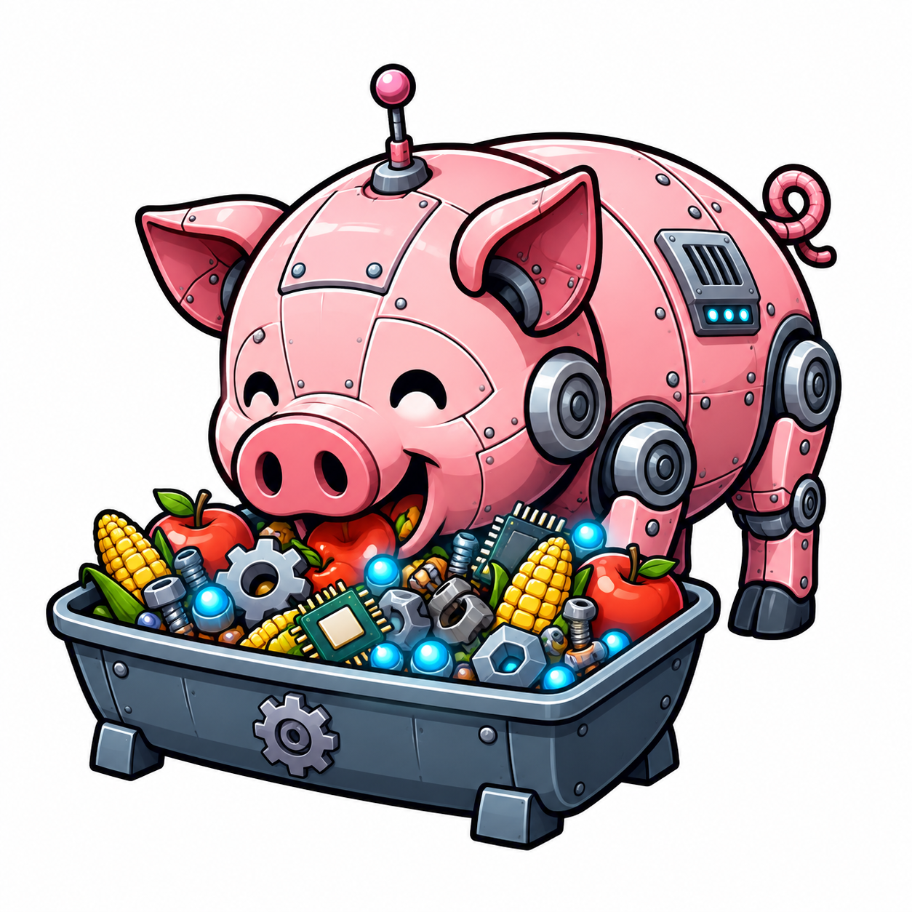

# AI Slop Trough



Reusable AI-generated artifacts that are generic enough to share, cheap enough
to copy, and useful enough to keep.

## Table of Contents

- [What This Is](#what-this-is)
- [Current State](#current-state)
- [Start Here](#start-here)
- [Icon Share](#icon-share)
- [Repo Layout](#repo-layout)
- [Rules of the Trough](#rules-of-the-trough)
- [License](#license)
- [Notes](#notes)

## What This Is

This repo is a controlled dumping ground for reusable generated assets.

The intent is practical:

- keep commodity AI output that other people can reuse
- organize it well enough that it stays searchable and linkable
- avoid mixing future asset types into the repo root

Right now, the repo contains one public collection: the icon share. It also
contains one curated external index:
[Other People's Slop](share/links/README.md).

## Current State

| Surface | Status | Notes |
| --- | --- | --- |
| [`share/icons/`](share/icons/) | Active | Public icon library with metadata, gallery, and provenance |
| [`share/links/`](share/links/) | Active | “Other People's Slop,” a curated index of external icon packs and icon-generation tools |

## Start Here

If you only need the useful parts, start with these:

- [share/icons/README.md](share/icons/README.md): human-readable overview of
  the current icon collection
- [share/icons/index.html](share/icons/index.html): lightweight static browser
  for the icon catalog
- [share/icons/catalog.json](share/icons/catalog.json): machine-readable index
  for search, tagging, or import tooling
- [share/icons/catalog.schema.json](share/icons/catalog.schema.json): JSON
  Schema for the icon catalog shape
- [share/links/README.md](share/links/README.md): Other People's Slop, a
  curated page of external icon packs and tools
- [share/README.md](share/README.md): collection-level index for the `share/`
  surface
- [share/CONTRIBUTING.md](share/CONTRIBUTING.md): import and contribution
  contract for future collections

## Icon Share

The current collection under `share/icons/` contains:

| Metric | Value |
| --- | --- |
| Unique icons | `140` |
| Exported PNG assets | `560` |
| Sizes | `64`, `128`, `256`, `512` |
| Public buckets | `marine-life`, `marine-items`, `maker-lab`, `office-items` |
| Gallery | [`share/icons/index.html`](share/icons/index.html) |
| Metadata | [`share/icons/catalog.json`](share/icons/catalog.json) |
| Schema | [`share/icons/catalog.schema.json`](share/icons/catalog.schema.json) |

The icon share is intentionally split into nominal buckets instead of
preserving raw source-pack names. That keeps the public surface usable while
still preserving source provenance under `share/icons/_meta/`.

The gallery includes copy actions for direct asset paths, Markdown image
snippets, and HTML `` snippets.

For local browsing, serve the repo root and open the gallery:

```bash
python3 -m http.server
```

Then open `/share/icons/`.

## Repo Layout

```text
share/
  CONTRIBUTING.md
  README.md
  icons/
    README.md
    index.html
    catalog.json
    catalog.schema.json
    marine-life/
    marine-items/
    maker-lab/
    office-items/
    _meta/
  links/
    README.md
```

The repo is structured so future real collections can be added under
`share/<collection>/` without changing the meaning of the current icon library.

## Rules of the Trough

1. Useful beats polished.
2. Metadata beats mystery.
3. CC0 is the default unless a collection says otherwise.
4. Preserve provenance when it is available.
5. Avoid intentional trademarks, protected characters, public figures, and
   brand impersonation.
6. Every public collection lives under `share/`.
7. Do not add empty collection scaffolding. Add a collection when there is real
   content to share.

## License

The repository currently uses `CC0-1.0`.

That is the right default for this repo’s current purpose: low-friction reuse
of generated assets without attribution overhead. If a future collection needs
different terms, that collection should declare them explicitly inside its own
directory.

## Notes

These assets are AI-generated and provided as-is. No trademark, publicity,
privacy, or other third-party rights are granted.
